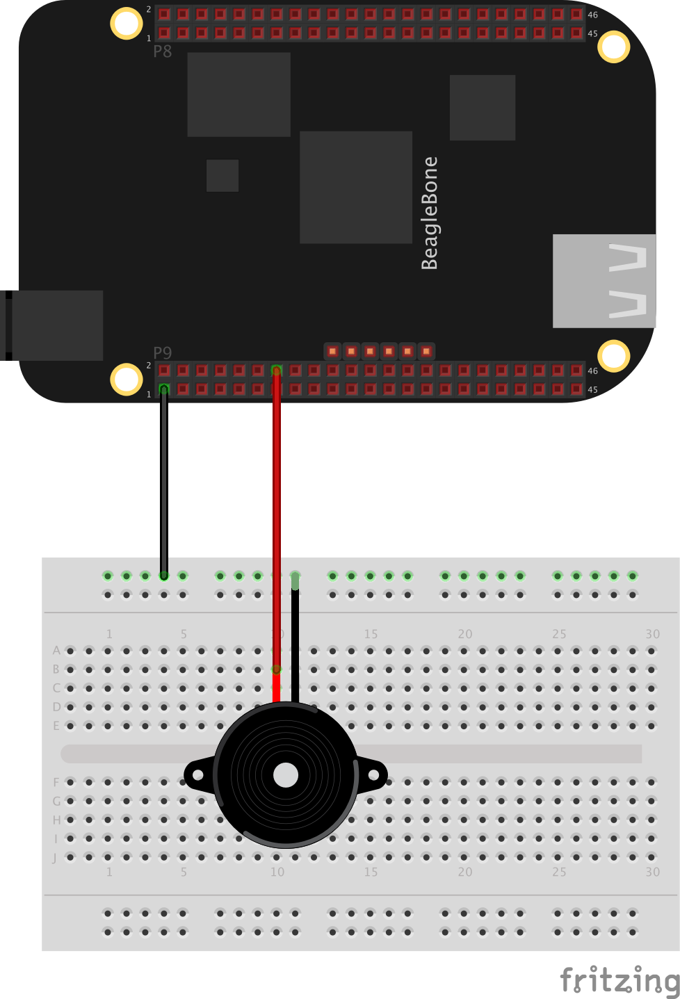

##Control an Piezo Buzzer using Zetta and bonescript!

###Install

```
$> npm install zetta-buzzer-bonescript-driver
```

###Usage

```
var zetta = require('zetta');
var Buzzer = require('zetta-buzzer-bonescript-driver');

zetta()
  .use(Buzzer, 'P9_14')
  .listen(1337)
```

### Hardware

* [Beagle Bone](http://beagleboard.org/black)
* [Piezo Speaker](https://www.sparkfun.com/products/7950)



###Transitions

#####turn-on-continuous

No arguments. Turns on the buzzer continuously at 500Hz with a subtle blip every 500ms.

This signal conforms to Swedish Standard SS 03 17 11, No. 4 "All clear"

#####turn-on-pulse

No arguments. Alternately turn the buzzer on at 500Hz for 150 ms then off for 100ms.

The signal conforms to Swedish Standard SS 03 17 11, No. 1 "Imminent Danger".

#####turn-on-alternating

No arguments. Alternately turns on the buzzer at 560Hz for 100 ms then off for 400ms.

The signal conforms to "French fire sound" NF S 32-001-1975.

#####turn-off

No arguments. Turns off the beeping.

#####beep

No arguments. Beeps the buzzer once.

###Design

The sound designs in the buzzer driver follow international standards. Confer with list of alarm sound tones from [Siemens](http://www.buildingtechnologies.siemens.com/bt/global/en/firesafety/fire-detection/cerberus-pro-fire-safety-system/peripherals/alarm-equipment/pages/alarm-sounds.aspx).